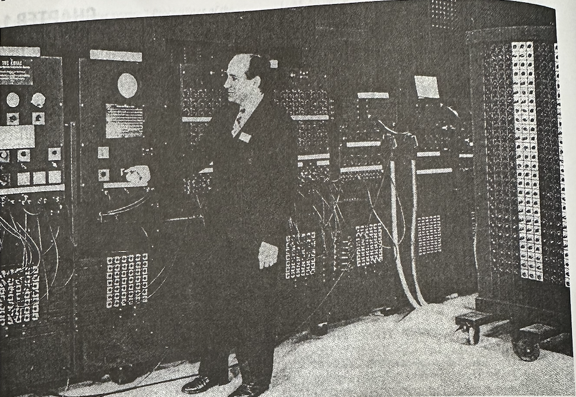
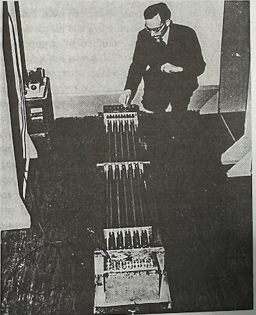
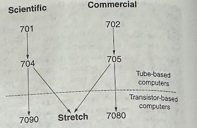
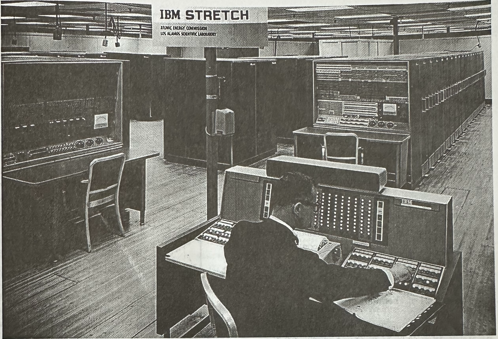
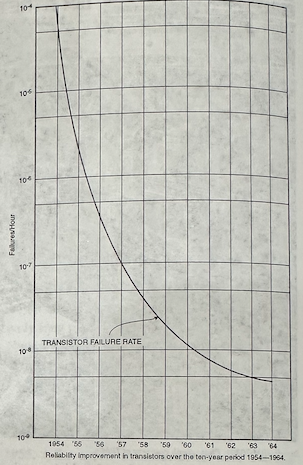
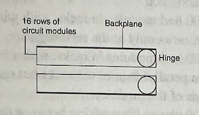
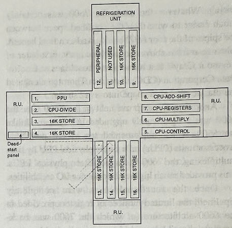
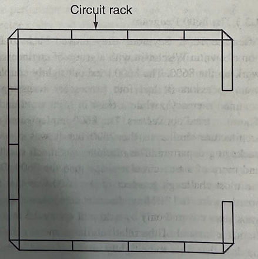

# Chapter 1: 经典机器：技术、实现和经济性

 * Architecture of the IBM System/360  --------------------------- 17
  *G.M. Amdahl, G. A. Blaauw, F. P. Brooks, Jr.*
 * Paralle Operation in the Control Date 6600 -------------------- 32
  *J.E. Thornton*
 * The CRAY-1 Computer System ------------------------------------ 40
  *R.M. Russell*
 * CRAY-1 Computer Technology ------------------------------------ 50
  *J.S. Kolodzey*
 * Cramming More Components onto Integrated Circuits ------------- 56
  *G.E. Moore*
 * The History of the Microcomputer -- Invention and Evolution --- 60
  *S.Mazor*

## 1.1 介绍

&emsp;&emsp; 在过去一百年实现计算系统的技术极大的变化。计算机和他们的体系结构在每一个时间点都是当时技术和能力限制的结果。在这一部分，我们通过对计算机历史从技术角度的浏览来展现这一原则。对技术本身、技术进步和技术的局限有良好理解非常重要，可以对未来计算机和体系结构的发展有更好的理解。

## 1.2 早期计算机技术

&emsp;&emsp; 在20世纪的前1/3，技术被限制在机械和电子机械计算器上。在1930年间，开始有几个构建电子计算器的实验，采用电子真空管。从1937年到1942年，Atanasoff和Berry在Iowa州立大学用真空管二进制电路构造了一台计算机（ABC），并且配置了一个电容式存储记忆鼓。这台计数器几乎就要完全可以进行操作时，二战爆发导致研发完全停止。下一台重要的真空管计算机开发就是ENIAC，1945年在宾夕法尼亚大学摩尔电子工程学院建成并操作运行。

### 1.2.1 ENIAC计算机技术

&emsp;&emsp; ENIAC有超过18,000个真空管。真空管需要一个加热元件以从阴极置换出电子。这需要大量的电能。加热元件还有一个趋势是操作一段时间后就会耗尽。因此，根据所有管子消耗的整体电能，以及在真空管失效之间的估计时间，可以得到一个真空管计算机的最大可实现尺寸。在ENIAC的时代，大多数真空管的寿命只有数千个小时。更糟糕的是，真空管的失效随着生命周期按照概率分布而广为散播。在这些障碍之下，可能有人会认为建造这样一个18,000真空管的计算机是不可能的。

&emsp;&emsp; 
**图 1.1. ENIAC的与Pres Eckert近距离视图。安装在轮子上的大型旋转开关面板是三个常数表之一。使用腰部以下的开关组输入程序。**ENIAC：图片由Hagley博物馆和图书馆提供

&emsp;&emsp; J. Presper Eckert用多种技术解决了真空管的可靠性问题：

 * 真空管的失效呈现双峰特性，更多的失效出现在操作开始阶段，以及经过数个小时操作之后，而在操作中间比较少。为了实现更好的可靠性，他使用了已经在机器内部放置好的真空管，而不用担心新安装管子的故障问题。同时机器在夜晚也不关机，因为供电循环也是也是增加失效的原因。
 * 组件仅以其标称能力的一半运行，减少压力并且降级管子，显著的的增加了操作寿命。
 * 使用了二进制电路，因此在晶体管变得更加脆弱或者发射泄漏的时候，不会像模拟计算机一样立刻导致错误。
 * 机器使用电路模块构建，错误很容易被定位探明，并且可以迅速被相同的模块替换。

&emsp;&emsp; 因为这一杰出的工程化方法，ENIAC能够在没有一次错误失效的情况下运行1天或者2天！ENIAC每秒能够完成5,000次操作。整机电路占据2,400立方英尺，重量30吨，消耗140kW电能。

&emsp;&emsp; ENIAC的体系结构类似于一组机械加法机器的电子版本。没有我们现在所想的主内存，只有一组20个10位数累加器。在累加器中的数字被存储在由10个触发器(flip-flops)构成的环中，当一个数字出现时相应的触发器被设置，而环中其他触发器状态被清除。一个10位数累加器需要总共550个真空管！程序通过插线面板来输入，而数字常数可以通过由选择开关柜子组成的3个函数功能表来输入(参见图1.1)。

&emsp;&emsp; 在ENIAC项目快结束时，Eckert、John Mauchly、John von Neumann和其他为项目工作的人员，开发出了存储程序计算机的概念。这一想法，在1945年6月以名为《EDVAC报告的第一份草案》[24]的报告标题发表，von Neumann是作者名单上的唯一一人。之后，在1946年夏天，摩尔学院举办了一个特殊的暑期学校。这一研讨班有来自世界各地的广泛的研究人员，并导致了在许多地方计算机建造的爆发。

&emsp;&emsp; 正如可以想象到的，ENIAC的主要局限在于缺乏存储器（特别是为了存储程序而实现的存储器）。甚至，即使能够用一个更高效的二进制表示来进行存储，真空管触发器也太贵，并且太不可靠，不足以建造一个存储程序的计算机。现在需要的是一个可靠的、不太昂贵，并且快速的存储器技术。在1940年代后期，以及1950年代早期，研究人员实验了多种不同的技术来实现计算机存储。这些候选包括：静电式存储器（例如Williams Tube）和多种类型的声学延迟线（例如水银延迟线）。

### 1.2.2 EDSAC计算机技术

&emsp;&emsp; Maurice Wilkes参加了1946年在摩尔学院的暑期学校，并且立刻返回剑桥大学，开始着手实现一台存储程序计算机。首先，Wilkes解决了为计算机提供一个存储器的问题。在1947年初，他设计并且构造了第一个可用的水银声学延迟存储器（如图1.2所示）。它由16个管子组成，每个管子可以存储32个字，每个字17位（16 位加一个符号），总共512个字（大约1KB）。既然已经展示了一种合适的存储技术，就可以继续设计和制造机器了。由于汞声学延迟线是一种位串行存储技术，因此这决定了位串行机器的组织方式。

&emsp;&emsp; 
**图 1.2. Maurice Wilkes正在查看EDSAC的第一组汞延迟线存储器。这组存储器包含16个管子，其中最上面一排的5个管子直接可见[25]。**图片来源：波士顿计算机博物馆

&emsp;&emsp; Wilkes更感兴趣的是拥有一台他可以编程的机器，而不是推动硬件技术的发展。由于这种保守的硬件设计，他确定的机器周期时间（500kHz）比当时讨论的其他机器慢了两倍。部分由于这种保守的硬件设计和实用存储技术的早期成功，电子延迟存储自动计算器(EDSAC: Electronic Delay Storage Automatic Calculator)于 1949年5月成为第一台大规模操作存储程序计算机。这使得该项目在许多软件创新中处于领先地位。EDSAC项目早期经验中的一项关键创新是子程序调用指令，该指令保存调用地址以供以后用作返回地址。当时，这被称为惠勒跳转，以大卫·J·惠勒(David J. Wheeler)的名字命名，他在研究生期间从事该项目时发明了它。惠勒的另一项创新是世界上第一个重定位程序加载器。

&emsp;&emsp; 由于机器的时钟周期和位串行的机器组织，简单的命令需要1.5毫秒。然而，更大的限制是I/O设备的速度。EDSAC使用纸带阅读器和电传打字机作为I/O设备。电传打字机每秒可以打印10个字符，而光学纸带阅读器每秒可以读取50个字符（每个字符仅由6个数据位组成）！

### 1.2.3 曼彻斯特/费兰蒂Mark I计算机技术

&emsp;&emsp; 曼彻斯特大学是存储程序计算机实现领域的早期领导者。1948年6月21日，一台只有五条指令和32个字内存的简单试验台机器运行了第一个存储程序。由于早期的成功，他们决定制造一台全尺寸计算机。这台机器的设计工作外包给了费兰蒂公司。这台机器使用由弗雷德里克·C·威廉姆斯（Frederic C. Williams）和汤姆·基尔伯恩（Tom Kilburn）在曼彻斯特发明的威廉姆斯管作为静电主存储器。但由于威廉姆斯管只能存储32个32位的字，因此需要更大的存储设备。

&emsp;&emsp; 伦敦伯克贝克学院(Birkberk College)的Andrew D. Booth是存储设备的早期创新者。他开发了热存储器、机械存储器、延迟线和旋转磁存储器。在早期磁盘存储器实验失败后，他在父亲（一名机械工程师）的帮助下开发了第一个磁鼓存储器（drum memory）。

&emsp;&emsp; 曼彻斯特团队决定使用威廉姆斯管和磁鼓构建一个存储层次结构。通过使用八个升级后的Williams管，他们在1951年的Ferranti Mark I中提供了总共256个40位字的主存储器。这由一个包含16,384个字的存储鼓备份。Mark I仅用0.03秒就将子程序从存储鼓传输到主存储器。（相比之下，EDSAC在这段时间内只能从纸带中读取 1.5个字符。）Mark I还是第一台带有索引寄存器的计算机。他们早期将内存块从主存储器传输到辅助存储器的经验以及寻址方面的专业知识促使曼彻斯特团队在1950年代后期在Atlas机器中发明了虚拟内存。

&emsp;&emsp; Mark I仍然是一台位串行机器（由 Williams 电子管的位串行访问决定），因此与其时钟周期时间相比，它的操作再次相当慢。加法等典型操作需要1.2毫秒。为了进一步提高计算机的性能，需要一种成本合理、可并行访问的大规模可靠主存储器，从而构建位并行计算机。

### 1.2.4 Whirlwind计算机技术

&emsp;&emsp; Whirlwind计算机是在20世纪40年代末和50年代初由麻省理工学院设计和制造的[18]。它旨在成为一台位并行计算机，比以前的计算机快得多（因此得名）。此外，它还设计了更快的最大5MHz时钟频率。最初，它使用16个Williams管设计，构成16位并行存储器。然而，Williams管存储器在运行速度、可靠性和成本方面存在限制。

&emsp;&emsp; 为了解决这个问题，Jay W. Forrester和其他人开发了磁芯存储器(Magnetic Core Memories)。当静电存储器被原始磁芯存储器取代时，Whirlwind 的运行速度翻了一番，机器的维护时间从每天四小时减少到每周两小时，内存故障的平均间隔时间从两小时增加到两周！核心存储技术对于Whirlwind在1952年实现每秒执行50,000次操作以及相对较长时间的可靠运行至关重要。

&emsp;&emsp; 
**图 1.3. IBM Stretch 的关系。**

&emsp;&emsp; 现在已经找到了一种良好的存储技术，用于算术和控制的电子管电路成为主要限制因素。

### 1.2.5 基于锗晶体管的计算机：IBM Stretch

&emsp;&emsp; 到1955年，不少制造商都在制造基于真空管和磁芯存储器的计算机。由于可用于设计CPU的组件数量受到真空管的可靠性和成本的限制，因此计算机往往在其目标细分市场中相当专业化。例如，面向科学用户的机器无法负担会计用的打包十进制算术电路；同样，面向商业用户的机器无法负担浮点支持。此外，面向高性能用户的机器往往具有更大的字长，而性能较低且成本较低的机器则无法负担。再加上使用汇编语言编程，这导致所有不同型号的开发成本相当高，并且软件基础互不兼容。

&emsp;&emsp; 
**图 1.4. Stretch的整体视图，于1961年首次交付给客户。**Stretch(IBM 7030)：照片由IBM提供

&emsp;&emsp; IBM拥有科学和商业电子管计算机生产线，分别从701和702型号开始。这些型号经过了重大的重新设计和改进，并以704和705的名称出售。1955年，IBM发起了一项研究项目，旨在生产一台比704或705型号快一百倍的计算机，并兼具科学和商业功能。这台机器正式称为7030，但大多数人都知道它的项目名称“Stretch”[2、5、6]。它在IBM产品线中的位置如图1.3所示。Stretch的照片如图1.4所示。

&emsp;&emsp; 通过切换到早期的锗晶体管技术，Stretch中的电路运行速度提高了十倍。此外，通过使用高速核心内存，内存访问速度比704中的核心内存快了大约六倍。但是，该项目将速度提高两个数量级的目标远远超出了新技术所能实现的速度提升。这将需要许多体系结构创新，而这反过来又需要比以前的计算机更多的电路，但这是通过晶体管与真空管相比可靠性提高、尺寸减小和成本降低而实现的。这导致了一个至今仍在利用的主题：使用工艺技术提供的附加电路来利用指令级并行性。

&emsp;&emsp; 借助Stretch，指令级并行性的利用呈现出许多新形式。首先，指令的处理是流水线式的（这在当时被称为“重叠overlapped”或“前瞻lookahead”，因此在任何时间点都有6条指令处于某个执行阶段。其次，为了给内存提供更高的带宽，内存被分成多个存储体(Memory Bank)。由于连续的字存储在不同的存储体中，因此即使核心内存的延迟为2微秒，通常也可以每0.2微秒获取一次新数据。第三，提供了一个自动传输引擎来在内存和外围设备（例如：DMA或一个原始通道）之间传输数据。

&emsp;&emsp; 设计人员意识到，如果只提高CPU的性能而不提高I/O设备的性能，将导致整个系统加速较低。因此，作为Stretch项目的一部分，第一个具有多个读写臂的磁盘驱动器被开发出来。其容量（2MB）和传输速度远远超过当时其他任何产品，导致人们放弃了使用磁鼓作为二级存储。

&emsp;&emsp; 尽管Stretch并未完全实现其性能提高100倍的目标（尤其是在商业代码方面，这方面使用的是字节串行数据存储，见表1.1），但Stretch带来了许多体系结构和技术上的重大进步。此外，它结合了科学和商业功能，是IBM System 360体系结构的前身。

&emsp;&emsp;
**表1.1: 在IBM704、705和Stretch中的关键延迟**

|  |  |  | **时间以微秒计** |
| **操作** | **IBM 704** | **IBM 705** | **Stretch** |
| :---- | :----: | :----: | :----: |
| **浮点加法** | 84 | - | 1.0 |
| **浮点乘法** | 204 | - | 1.8 |
| **浮点除法** | 2164 | - | 7.0 |
| **五位数加法** | - | 119 | 3.5 |
| **五位数乘法** | - | 799 | 40.0 |
| **五位数除法** | - |4828 | 65.0 |

### 1.2.6 大规模平面硅晶体管计算机

&emsp;&emsp; ***硅平面晶体管的出现与Control Data 6600之间存在着惊人的时间关系。-J. E. Thornton，《Design of a Computer：Control Data 6600》[21]，第19页。另请参见图1.5，转载自Thornton[21]第21页。 ***

&emsp;&emsp; Stretch采用锗晶体管设计。到20世纪60年代初，平面planar（双扩散double-diffused）硅晶体管已经开发出来，其可靠性和性能特征比锗晶体管有显著提高。“平面”是指这些晶体管是通过将杂质扩散到平坦的硅晶片中以形成基极和发射极而制成的。

&emsp;&emsp; 硅平面晶体管相对于锗的主要优势在于：
   * 允许更高的结温（因此在较低温度下具有更高的可靠性）
   * 可提供更高的电流和功耗水平
   * 速度更快（通过使用n-p-n配置而不是p-n-p配置）
   * 成本更低

&emsp;&emsp; 所有这些优势的结合是20世纪60年代中期一代机器的关键推动因素，它们的性能、可靠性和成本得到了极大的提高。这些机器包括CDC-6600和IBM 360系列。

## 1.3 超级计算机的兴衰

&emsp;&emsp; 直到20世纪90年代末，高端CPU都是独一无二的。从历史上看，高端计算机是使用双极型晶体管制造的。这与当今微处理器中使用的MOS晶体管形成鲜明对比。20世纪60年代的双极晶体管相对容易制造，因为它们的有源部分由两个可以通过扩散过程生长的p-n结组成。它们的速度也比早期的MOS晶体管快十倍以上，而早期的MOS晶体管直到20世纪60年代末才开始批量生产。

&emsp;&emsp; 
**图 1.5. 1954年至1964年10年间晶体管的可靠性改进。**晶体管可靠性图，摘自Jim Thornton所著的《计算机设计：CDC 6600》第21页。

&emsp;&emsp; 由于双极晶体管相对较快，20世纪60年代或70年代高端计算机的大部分延迟都是由于通过计算机线路发送信号所需的时间造成的。一些高端计算机（如 CDC Cyber​​ 205系列）使用同轴电缆，允许以70%的光速传输信号。然而，Cray的机器使用速度稍慢的双绞线，但依靠更密集的封装和电路来减小机器的尺寸，从而减少从机器的一个部分到另一部分的通信所造成的延迟。

&emsp;&emsp; 不同制造商制造的超级计算机有很多种型号。在本节中，我们主要关注由Seymour Cray设计的计算机，原因有三。首先，它们中的大多数都是当时性能最高的计算机。其次，它们引入了许多重要的体系结构和实现特性。第三，通过集中研究单一的计算机系列，技术的潜在趋势变得更加清晰。

&emsp;&emsp; 
**图1.6. 一个1604逻辑“book”结构**。

&emsp;&emsp; Seymour Cray制造的机器的形状本身就是一项有趣的研究。Seymour Cray是计算机封装和计算带宽领域的领导者。他的第一台大型机器CDC 1604是单一“书book”式配置。十六排小型电路模块塞在两块背板上，背板通过铰链Hinges灵活地安装到机器的其余部分。这使得电路板可以在建造或测试期间分开，就像幼儿纸板书中的页面一样（见图1.6）。

### 1.3.1 CDC 6600

&emsp;&emsp; CDC 6600结合了四本书，每本书有四页，书脊朝向机器的中心。这形成了机器的加号形“+”中心，如图1.7所示。这种配置后来被大型机和日本超级计算机广泛使用。有关6600和其他Cray机器的照片，请参阅本书的网络配套内容，以获取在线照片的链接。

### 1.3.2 CDC 7600

&emsp;&emsp; 7600相对于6600的一个重大进步是引入了全流水线计算单元。尽管时钟速度没有快四倍（27.5纳秒），但峰值性能却比6600快了大约七倍。它还减少了将组件彼此靠近的需要。

&emsp;&emsp; 与必须彼此靠近的大块的非流水线逻辑不同，流水线式功能单元允许每个单独的功能单元流水线阶段在物理上更小、更快，即使整个流水化功能单元更大。图1.8显示了构造成大“C”形的机器，三面有四个面板，第四面有两个面板和一个开口。

&emsp;&emsp; 
**图 1.7. 经典的6600加号机器配置，后来被其他制造商广泛用于超级计算机。在 6600 中，四本书的每一页都包含多达 756 个“cordwood”逻辑模块。**图26摘自Thornton的《计算机设计》第 35 页

&emsp;&emsp; 完整的流水线使使用大型“C”形底盘成为可能，但可能也需要它。由于机器完全流水线化，单元之间所需的带宽大于6600。只能从边缘访问书中的每一页所限制的带宽提供要比每页的完整正面都可用于布线时低得多。无论如何，7600肯定比四本6600书脊之间的狭窄空间更容易布线。作为最后一个好处，从上方看，这台机器是 Seymour Cray姓氏的首字母。后来，吉姆·桑顿(Jim Thornton)领导下的控制数据公司(CDC)的机器将经典的加号形状拉长为“t”形。

&emsp;&emsp; 
**图 1.8. 7600大型“C”形机箱配置。**

&emsp;&emsp; 7600相对于6600的另一项重大改进是显著升级的I/O系统。与通过时间复用在单个物理PPU上实现十个虚拟外设处理器单元(PPU: Peripheral Processor Uninit)的6600不同，7600最多有15个物理PPU。这提供了更高性能的I/O功能。

&emsp;&emsp; 一旦功能单元完全流水线化，6600体系结构中提供的有限数量的寄存器（7600向后兼容）将是一个主要限制。此外，7600被限制为每周期发出一条指令，峰值指令带宽比完全流水线功能单元提供的指令带宽少九倍。这两个限制都通过在Cray-1中添加向量寄存器和操作来克服。

&emsp;&emsp; 7600的100x100 Linpak性能是6600的7倍。它于1969年首次出货，比6600晚了五年。这是48%的年化性能提升。为了进行比较，请注意，根据摩尔定律，器件数量的年增长率为59%，而根据缩放理论[7]，MOS器件速度的年增长率为26%。MOS器件的最大潜在性能提升将由器件数量和器件速度增长率的乘积给出。

### 1.3.3 8600计划

&emsp;&emsp; 7600之后，Seymour Cray带着一组工程师回到威斯康星州的家乡，开始研究8600。8600尝试了紧耦合多处理器（它有四个处理器访问一个公共内存），而Thornton领导的明尼苏达州的一个团队则尝试了向量。 8600采用了与7600类似的体系结构，但封装设计却大胆前卫。与7600相比，该机器小得多，而且更接近真正的圆形。但8600最具挑战性的方面是，其电路板上充满了微小的分立元件（例如，晶体管仅被直径为2.5毫米的一滴环氧树脂覆盖，而不是当时相对较大的金属罐），这些元件必须紧密连接在真正的三维(3-D)砖块中。这在平行板面之间的垂直方向上提供了比仅在板边缘上可用的更多导线。这可以看作是6600和7600继续进展的下一个合乎逻辑步骤：
   * 6600的模块位于机架中，机架之间的布线仅在机架边缘。
   * 7600的模块位于机架中，布线来自机架的平行面，但仅来自模块的边缘。
   * 8600的模块表面之间需要布线。

&emsp;&emsp; 密集封装可使机器的周期时间为8纳秒。

&emsp;&emsp; 不幸的是，8600计划存在三个问题。首先，电路板和组件的紧密堆叠会产生大量热量，这些热量很难从电路板堆栈中去除，从而导致过热；其次，电路板之间的3D连接（数量众多）非常小，难以测试和组装。这导致制造良率低和可靠性低。但第三个问题是，在这些问题得到解决之前，CDC的财务困难迫使8600项目取消。因此，Seymour Cray和一个小团队离开CDC成立了Cray Research，但他们确实从CDC获得了初始资金。

### 1.3.4 Cray-1

&emsp;&emsp; 在Cray Research，最初的重点是快速开发无风险的超级计算机，以开始为公司的运营提供收入。因此，他们没有攻克8600面临的相对困难的问题，而是采取了不那么激进的方法。结果就是Cray-1[19]，它在物理上与8600相似，但要大得多，因为它只使用模块边缘之间的通信，而不是模块表面之间的通信。这也使冷却变得更容易，因为在每个模块的边缘使用冷却板（机架并排放置在一个270°的圆内）。

&emsp;&emsp; 在时钟频率和封装方面，Cray-1的设计比8600更保守。此外，向量体系结构是7600完整流水线的扩展，增加了更多寄存器（八个64元素向量寄存器加上 A和S寄存器后面的64个寄存器B和T bank组）。向量寄存器是“体系结构上的首创”，可大大提高性能。

&emsp;&emsp; Cray-1还包含许多技术上的首创。它使用了第一个商用发射极耦合逻辑(ECL: Emitter Coupled Logic)集成电路，可补偿温度、电源电压和工艺的变化。Cray-1之前的机器使用双极晶体管作为开关（如晶体管-晶体管逻辑或TTL），这导致晶体管进入饱和状态，使其切换速度相对较慢。相比之下，Cray-1中的ECL电路由高速差分放大器构建，其晶体管永远不会进入饱和状态。除了速度快之外，由于ECL门是差分放大器，它们可以产生真值输出和对应的补输出。这使得它们能够比其他电路技术在每个门级提供更多的逻辑功能。ECL门还具有高扇出度，并且仅通过将发射极跟随器输出连接在一起（线或）即可构建或门。ECL的高门功能性有助于实现Cray-1的逻辑设计，使得每个周期仅使用8个门延迟。结合ECL的高门速度，Cray-1的周期时间比当时任何其他计算机都要快得多。它的12.5纳秒周期时间直到1976年第一台Cray-1发货20年后才被商用CMOS微处理器超越。即使是使用双极型TTL逻辑变体和昂贵的多芯片模块的IBM大型机，在15年内也没有超越Cray-l的周期时间。这里的一个教训是，“双极”机器的速度在很大程度上取决于电路技术。

&emsp;&emsp; 从商业角度来看，Cray-1相对容易制造，并且在性能上远远领先于所有其他超级计算机。这一空间使Cray Research能够创建Cray-1、Cray-1S和Cray-1M的几个直接衍生产品。该系列产品约售出65台。相比之下，经济上成功的、价值数百万美元的超级计算机通常销售数量是20到50，而更低的典型数字通常意味着失败。

&emsp;&emsp; Cray-1时钟周期是7600的三分之一。通过添加向量，它实现了100x100 Linpak性能27MFLOPS，比7600快约8倍。7600推出七年后，这款产品的性能增长率约为每年35%。这低于从6600到7600的48%的增长率，也明显低于MOS微处理器接近60%的性能增长率[9]。

### 1.3.5 Cray-2

&emsp;&emsp; 现在公司的基础已经稳固，Seymour Cray回归了更偏向研究的风格（与公司名称相符）。此外，一系列采用改进技术的衍生机器（由Steve Chen设计的字母系列X-MP、Y-MP等）继续为公司提供支持。Seymour Cray制造的下一台机器极其类似于8600的更新版本：Cray-2。

&emsp;&emsp; 最初，为了获得比Cray-1更高的时钟速度，Seymour Cray想在Cray-2中使用砷化镓。在Cray-1技术论文[11]的结尾可以看到这种采用GaAs的方向。但砷化镓技术还不够成熟，无法投入使用，因此经过一段时间的延迟，Cray-2最终由16-gate双极ECL门阵列构建而成。Cray-2是一款四路多处理器（类似8600，但增加了向量），它解决了3-D电路堆叠问题。人们发现了一种更可靠的电路板互连技术，允许在电路板的平行面之间建立比边缘更多的连接。通过将整台机器浸入Fluorinert中，解决了热量问题。尽管Fluorinert最初是作为人工血液替代品开发的，但它并未用于医疗。然而，作为液体，它的热容量比空气更好，并且在电气和材料上都是惰性的。这款Cray-2的时钟周期为4.1纳秒（比Cray-1快3倍，但仅比所提出的8600快2倍），最多可容纳4个处理器。向量体系结构与Cray-1几乎相同，但不允许链接chaining。Cray-2使用DRAM作为主存（与Cray-1和X-MP中的SRAM 不同），因此它的访存延迟更长，并且必须高度分bank组织（128路）[10]。由于内存较慢，每个处理器的性能偏向长向量代码，并且不会根据时钟频率进行扩展。该机器是四处理器多处理器。这提高了并行应用程序的性能，但没有提高非处理器部分的性能。再加上项目延迟和字母系列中更灵活的链接以及多个内存端口的实现（Cray-1和Cray-2 每个处理器只有一个内存端口），这导致Cray-2的成功不够显著。但它仍然卖出了30台，主要是卖给了需要更大主存容量的客户。

&emsp;&emsp; 现在超级计算机的发展已经远远落后于光刻驱动的量产MOS工艺技术扩展曲线。Cray-2于1985年问世，比Cray-1晚了9年，但其时钟周期时间仅快了3倍。这仅仅是每年13%的复合增长率。

### 1.3.6 Cray-3 和传统超级计算机的消亡

&emsp;&emsp; Cray-2之后，Seymour Cray继续砷化镓GaAs的研究。他的下一台机器将消除他设计中最后的二维痕迹：标志性的“C”形。“C”是二维的(2-D)，因为从“C”的一部分传输到另一部分的信号必须在由电路板堆栈和堆叠机架组成的（弯曲的）二维空间中传输。Cray-3将是一个立方体，底座每边长1英尺。这是一项极具挑战性的任务，因为测试和制造这样的机器非常困难。机器的内部零件无法进行测试，而互连件的尺寸很小，需要使用细线和精密激光焊接进行机器人组装。

&emsp;&emsp; 同样，Seymour的母公司没有资源继续开发现有的盈利型计算机产品线以及Seymour风险高昂的新业务。这导致Seymour Cray于1989年再次将他的项目分拆为一家新公司。由于Cray Research这个名字已经在使用，Seymour Cray将他的新公司命名为Cray Computer。这很讽刺，因为Cray Research从事计算机生产业务，而Cray Computer更像是一个研究型风险企业。

&emsp;&emsp; Cray-3于1993年发布。虽然该机器应该有16个处理器，但最终只有一个处理器被提供用于评估。它的周期时间为2纳秒。这是Cray-2发布8年后，但速度只提高了2倍。非处理器部分的性能增长率已降至每年仅9%，但与此同时，体系结构技术的制造和测试难度却大大增加。作为一项业务，这在经济上是不可持续的，即使与Cray Research更传统的计算机系列相比也是如此。1994年发布的Cray Research T90使用双极型标准单元，时钟眼时间为2.2纳秒。但它还具有双向量流水线、支持链接、标量缓存，并且最多能有32个处理器。这使其总峰值性能比完整的Cray-3高出8倍。一台3D计算机可能永远无法在经济上甚至技术上站得住脚。

&emsp;&emsp; 到1993年Cray-3发布时，量产CMOS工艺技术的扩展已使时钟速度高达200MHz，DEC Alpha 21004微处理器就是明证[14]。该芯片的性能受到其I/O接口的限制，该接口仅由芯片边缘的引脚组成。最近，量产微处理器芯片采用了凸块技术（bump technology），允许在芯片的整个表面而不是仅在边缘进行互连。因此，从某种意义上说，他们在技术上追随Seymour Cray的脚步，但以一种必需保持盈利的风格。

## 1.4 基于MOS微处理器的计算机兴起

&emsp;&emsp; 20世纪70年代，ECL等非饱和双极工艺技术之所以比MOS快得多，主要原因是它们的基极宽度非常窄，可以通过扩散（以及后来的离子注入）精确控制，使其比当时的光刻线宽小得多。例如，1967年IBM 360/91 中使用的晶体管的基极宽度为0.5微米[12]，而产品级光刻特征尺寸约为20微米[9]。但是，双极基极可以制造的宽度有一定的最窄限制，这些限制接近当今MOS晶体管通过先进光刻技术所实现的宽度。例如，最近的高性能双极门阵列工艺的基极宽度约为0.08微米，自1967年以来，复合年变化率仅为6.3%。因此，随着摩尔定律[16]的发展，非饱和双极工艺技术和MOS工艺技术之间的性能差距正在缩小。

&emsp;&emsp; 不同技术在量产制造的差异导致可持续技术投资水平不同。超级计算机中使用的双极技术是一项非常高端的技术，但出货量相对较低。这意味着可用于投资双极技术的资金要少得多。结果，光刻和器件开发到20世纪80年代末，双极技术的发展开始落后于MOS技术。这进一步降低了双极技术相对于量产MOS技术的相对性能优势，导致相对产量更小。这显然是一个糟糕的循环。结果，到1998年，美国制造的超级计算机和大型机使用了多个采用量产CMOS工艺技术制造的微处理器。

&emsp;&emsp; 如果计算机的出货量很小，则必须将机器的设计成本摊销到少数机器上。这也限制了可用于设计的经济资源。因此，超级计算机和大型机一直都是用标准化的构建块构建的。一个极端的例子是Cray-1，它只使用了4种不同的集成电路。如果改用全定制技术，性能会提高多少？例如，仅由AND/NAND门构建的多路复用器需要两级逻辑，而在定制的多路复用器门中，从数据输入到数据输出的延迟减少到一个门延迟。同样，如果逻辑函数确实需要六个输入，则如果只有5/4个输入门可用，则将需要一个额外的逻辑级。

&emsp;&emsp; 相比之下，最初的微处理器是针对批量市场开发的。他们的器件预算也非常微薄。这导致了全定制方法和创新电路设计，这些设计一直持续到今天的高性能MOS微处理器中。全定制设计与激进电路设计的结合可能使系统性能比由大型MOS标准单元库构建的处理器高出三倍。

&emsp;&emsp; 许多年轻工程师认为“最好的产品”将在市场上获胜。不幸的是，市场比这复杂得多。微处理器指令集体系结构就是一个例子。人们可能期望最干净、最强大的体系结构和最高性能实现是最成功的。（一个具有这些特征的例子是Compaq的Alpha，目前其市场份额不到0.1%。）相反，人们会认为可以说是最不规则和性能最低的指令集体系结构（具有诸如只有几个寄存器、无正交性、单个条件代码寄存器和分段地址空间等“糟糕”特性，仅举几例）根本不会非常成功。然而，指令集体系结构的演进并不涉及生物学意义上的适者生存，因为ISA的强度很大程度上取决于已安装软件基础的大小。8008是第一个高性能微处理器体系结构（相比之下，4004是第一个微处理器体系结构）。因为它是第一个，所以它在开始时是最成功的。为了保留其客户群，在特定时间点最成功的体系结构将扩展当前技术所需的新功能。这将确保商业上最成功的体系结构继续取得成功。在现有的指令集体系结构上添加新功能，而这些功能在设计时并未考虑可扩展性，你可以想象到结果会是怎样。因此，在指令集体系结构演进过程中，幸存的体系结构将成为“最不适合”的体系结构之一。但这并不妨碍其实现成为“最适合”的体系结构之一，我们将在本读本的最后一章中解释这一点。

## 1.5 所含论文的讨论

&emsp;&emsp; 在本节中，我们介绍描述经典机器的技术、实现和经济性的论文。

### 1.5.1 Amdahl、Blaauw和Brooks的“IBM 系统体系结构/360%”[1]

&emsp;&emsp; 1961年11月，IBM成立了一个名为SPREAD委员会的小组，其职责是制定IBM未来十年的设计目标，并制定一个工程和营销计划，以统一IBM三个计算机分支部门的努力。1961年12月底，该小组的报告发布。它主张生产一系列兼容机器，从当时最小的商用机器到比Stretch更强大的科学计算机。经过大量的工程努力，IBM于1964年4月7日宣布推出360体系结构，其中包括150多种新产品、服务和设备[17]。IBM选择家族名称360来表示它在“360度数据处理”方面表现出色。

&emsp;&emsp; 在发布的同时，IBM的《研究与开发期刊》[1]发表了一篇出色的论文，阐述了360体系结构的设计原理。它不仅详细描述了体系结构，还描述了在体系结构形成之前所评估的权衡。它值得所有计算机体系结构设计师研究，并已经包含在本读本中。

### 1.5.2 Thornton的“Control Data 6600中的并行操作”[22]

&emsp;&emsp; ***上周，Control Data...宣布了6600系统。据我所知，在开发该系统的实验室中，包括看门人在内只有34人。其中，14人是工程师，4人是程序员。...将这种微不足道的努力与我们广泛的开发活动进行对比，我不明白为什么我们让别人提供世界上最强大的计算机而失去了行业领导地位。”—Thomas Watson，IBM首席执行官，1963年8月28日***

&emsp;&emsp; ***似乎Watson先生已经回答了自己的问题。—Seymour Cray对Thomas Waston的回应***

&emsp;&emsp; 正如上面的两段引文所示，CDC 6600是由一支专注、优秀的设计师组成的小团队开发的。他们的目标市场很窄（科学计算），因此该机器可以专门针对该市场。其中一个例子是60位的本机字长（在那些年里这很长），并且它只支持两种数据操作数类型：60位浮点值和60位整数。另一个例子是，它是第一台具有独立浮点功能单元的机器（这需要大量机器资源）。使用专门的功能单元导致操作延迟比当时在其他实现中常见的微码加法器/移位器数据路径低得多。例如，60位精度浮点加法的延迟仅为400纳秒！这与IBM 360实现形成了鲜明对比，后者必须实现十进制和字符串数据类型，并且通常围绕较小的数据总线构建。（直到1967年11月才发货的IBM 360/91是个例外，因为它省略了对十进制算术的硬件支持。）IBM 360体系结构还仅限于四个64位浮点寄存器，这限制了浮点指令之间的潜在重叠，并需要为360/91发明Tomasulo算法（一种寄存器重命名形式）[23]。

&emsp;&emsp; 由于6600设计团队规模较小，出于必要，该机器是围绕简单但优雅的原则构建的。这使它成为精简指令集计算机(RISC: Reduced Instruction Set Computer)体系结构的早期示例。此外，通过拥有一支小型灵活的设计团队，设计过程可以更快地进行。

&emsp;&emsp; 6600引入了许多体系结构创新，这些创新影响了计算机体系结构多年。首先，该机器有十个“外设处理器”来处理I/O功能。但是，它们是通过单个物理CPU（即桶式处理器或多线程处理器）上的周期交错实现的。由于内存读/写周期为十个周期，因此实现了十个虚拟处理器，因此每个虚拟处理器看起来都具有对主内存的单周期访问。

&emsp;&emsp; 其次，6600引入了一种称为“记分牌scoreboard”的动态调度形式。记分牌允许指令乱序发出，并利用机器的十个独立功能单元提供的并行性。由于机器没有条件编码（IBM360有条件编码），因此重新排序指令的执行要容易得多。该机器有八个操作数寄存器，可用于浮点或定点数据值，还有八个地址寄存器。将结果写入地址寄存器1-5的副作用是将该结果指定的内存地址的内容加载到操作数寄存器中。将结果写入地址寄存器6或7的副作用是将相应操作数寄存器的内容写入主内存。拥有显式寄存器来存储内存地址计算的结果，自然会产生自动递增和自动递减的load和store形式。

&emsp;&emsp; ***本书专门介绍A6和A7，如果没有它们，本书中的任何结果都无法保存。—Ralph Grishman为《Control Data 6000系列与Cyber​​ 70系列汇编语言编程》一书所写的献词[8]***

&emsp;&emsp; 6600也是一个出色的技术实现。在当时，它具有强大的流水线功能（整数加法有三个周期的延迟）。由于它可以在最佳情况下每个周期发射出一条指令，因此更深的流水线有助于它利用指令级并行性。为了支持功能单元的计算带宽，机器的主内存被分成32路的Bank形式！

&emsp;&emsp; Jim Thornton写了一本关于6600设计的经典著作[21]，不幸的是，这本书已经绝版了。书中材料的浓缩版出现在1964年秋季联合计算机会议上，我们已将其收录[22]。

### 1.5.3 Russell的《Cray-1计算机系统》[19]

&emsp;&emsp; Russell的论文对Cray-1的体系结构和实现进行了出色的介绍。论文中讨论的一项重要创新是Cray-1的向量寄存器。（以前的向量机只有内存到内存操作，启动时间很长，因此需要很长的向量才能获得显著的性能提升。）除了是第一台带有向量寄存器的机器之外，Cray-1还支持通过寄存器进行操作链接。这允许在第一个向量完整计算完成之前，第二个操作可以使用向量操作（包括向量load和store）的结果元素，从而大大减少了计算的延迟。Cray-1体系结构还因其引入了第二级程序员控制的寄存器文件（B和T寄存器）而引人注目。有关本文的更多亮点，请参阅本章的第1.3.4节。

### 1.5.4 Kolodzey的《Cray-1计算机技术》[11]

&emsp;&emsp; Kolodzey的论文用七页的篇幅有效地解释了Cray-1的构建方式。最有趣的图表之一是机器的底盘布局。这显示了机器体系结构的实现方式。在此图中，可以看到长倒数单元流水线从机器核心流出，而机器核心是更关键的控制功能所在的地方。该论文还提供了大量的实现信息，从组件到互连、电源和冷却。例如，一种芯片类型占机器中IC的95%，整个机器功耗为130kW！请注意，16x4 位寄存器部分与4输入AND/NAND门的组合自然会导致寄存器文件具有64个条目，用于8个向量寄存器、B、T和四个指令缓冲区中的每一个。

&emsp;&emsp; Cray-1使用锁存器latches而不是触发器flip-flops，因为它们具有较低的延迟。然而，在基于锁存器的设计中，最快的电路路径必须慢于机器周期时间的一半，否则信号可能在一个周期内通过多个状态设备。因此，Cray-1必须用额外的线路和/或门延迟来填充明显快于时钟周期时间的电路路径。

### 1.5.5 摩尔的《在集成电路上塞入更多组件》[16]

&emsp;&emsp; 基础技术的不断改进使计算机体系结构成为一个充满活力的领域。如果我们的实现技术仍然与1965年相同，那么在过去的三十五年里，计算机体系结构方面几乎不需要做任何工作。大多数技术改进都来自光刻和半导体技术。戈登·摩尔在二十五年前就预见了光刻和半导体技术进步的速度和好处，并在当时首屈一指的贸易杂志(Premier Trade Magazine)的一篇短文中进行了总结。

&emsp;&emsp; 这篇文章定义了摩尔定律，该定律指出每个芯片上的晶体管数量每年翻一番。该定律的一个推论是，每个晶体管的价格每年下降一半。另外三个推论是，功能的功耗以及延迟会随着缩放而降低，功能的可靠性会随着缩放而增加。

&emsp;&emsp; 在引用摩尔定律时经常被忽视的一个方面是，在过去30年里，半导体技术大约每三年翻两番。这给出了一个大约1.59的指数基数，而不是戈登摩尔原始论文中提出的2的基数。考虑到摩尔只是从4年内分布的4个非零数据点推断出来的，指数基数缺乏精度并不令人意外。以方程形式表示，摩尔定律的更准确公式是：

$N_{device_on_chip} = 1.59^{year-1959}$

&emsp;&emsp; 换句话说，芯片上的晶体管数量每年增加59%。可以通过取指数中的偏移年份并将年份中的第一个“9”替换为小数点来记住该公式，反之亦然。

&emsp;&emsp; 比指数基数的精度更重要的是本文中提出的所有技术扩展的含义。正是出于这个原因，我们认为这篇短文是本读本中包含的所有论文中最令人惊叹的。这篇论文的大部分内容读起来就像是昨天写的，而不是三十多年前写的。与当时和之后的其他论文相比，对比令人吃惊。相比之下，请考虑第2章中提出的“阿姆达尔定律”论文，其中甚至没有正式陈述“阿姆达尔定律”。过去四十年里的其他预测论文通常只做了一些预测，如果其中一两个成真，那就算幸运了。（还记得1970年磁悬浮列车、气泡存储器、廉价到无法计量的核能、太空旅行的普及以及计算机化的自然语言翻译的预测吗？）相比之下，摩尔定律论文做出了超过25 个预测，并且全部都已成真。仅在引言中就有12个预测已经实现。这让你怀疑 Gordon Moore在撰写论文之前是否首先发明了时间旅行机器。

&emsp;&emsp; 除了介绍摩尔定律及其推论外，该论文还指出了技术扩展的其他影响。以下是一些更重要的预测：
   * 电子产品的普及，将这门科学推向了许多新领域。（试着想象一下1965年的世界是什么样的：机电脉冲拨号电话交换机、仅限于包含几个晶体管的AM收音机的消费电子产品、用真空管制造的大型电视机。）
   * 家用电脑。（当时的计算机是大型机--尽管DEC于1965年推出了PDP-8小型计算机。）
   * 汽车自动控制（如今市场非常大）。
   * 个人便携式通信设备（例如手机）。
   * 电子手表--戈登·摩尔后来在Intel主导进入的市场，直到经济效益不佳，因为它变成了大宗商品市场。
   * 通过集成提高可靠性。（可惜这不适用于软件！）
   * 砷化镓的作用有限。
   * 集成密度高，每个组件成本最低。
   * 每个组件的功耗随着集成而降低，使进一步集成成为可能而不会发生熔化。
   * 市场规模和工程成本增加导致产品限制。
   * 使用标准功能构建大型系统。（在20世纪70年代，这意味着TTL，而今天则意味着商品级处理器。）
   * 线性电路的集成受到集成无源元件性能较差的限制；转而使用数字滤波器（例如，DSP现在已广泛用于从手机到PC声卡的各种设备）。
   * 在较低的微波频率下实现集总参数电路设计。
   * 相控阵雷达已经是可能的。

&emsp;&emsp; Denard等人在20世纪70年代初将摩尔定律对器件和电路特性的影响发展成为经典的缩放理论。[7]后来在20世纪80年代初的Mead-Conway[15]的VLSI课程中对其进行了简化和推广。

&emsp;&emsp; 只要摩尔定律继续发挥作用，就会有很多美好的事情发生。过去二十年来，集成电路的技术缩放一直是经济生产力提高的主要推动力，从而显著提高了生活水平。如果没有高度集成的电子设备（用于廉价PC和负担得起的网络路由器），即使是现代互联网也不可能实现。最后，过去四十年来，半导体行业在遵循摩尔定律方面取得的成功使计算机体系结构成为一个充满活力的研究领域。

### 1.5.6. Mazor的《微型计算机的历史——发明和演变》[13]

&emsp;&emsp; Mazor的论文解释了Intel 4004、8008、8080和8086是如何诞生的。8080设计最令人惊奇之处在于它仅用4,500个晶体管来实现。本文指出，8080体系结构是为低成本嵌入式应用而设计的，这解释了它的许多局限性。本文对第一批微处理器的成本考虑、市场和设计过程有很多见解。令人惊讶的是，功耗、引脚数、封装和工具成本在当时和现在一样重要。

## 1.6 参考文献

&emsp;&emsp; 许多书籍包含大量有关20世纪40年代至70年代计算机的信息。值得注意的例子包括Bell和Newell [4]、Siewiorek、Bell和Newell[20] 以及Bell、Mudge和McNamara[3]的书籍。

[1] G. M. Amdahl, G. A. Blaauw, and Frederick P. Brooks Jr.; "Architecture of the IBM System/360," IBM Journal of Research and Development, pp. 87-101, Apr. 1964.
[2] C. Bashe, L. Johnson, J. Palmer, and E. Pugh, IBM's Early Computers, Cambridge, MA: MIT Press, 1986.
[3] G. Bell, C. Mudge, and J. McNamara, Computer Engineering: A DEC View of Hardware Systems Design. Bedford, MA: Digital Press, 1978.
[4] G. Bell and A. Newell, Computer Structures: Readings and Examples. New York: McGraw-Hill, 1971.
[5] G. A. Blaauw and F. P. Brooks Jr., Computer Architecture: Concepts and Evolution. Reading, MA: Addison Wesley Longman, 1997.
[6] W. Bucholz (Ed.), Planning a Computer System. New York: McGraw-Hill 1962. IBM Stretch (7030)).
[7] R. H. Denard, F. H. Gaensslen, H.-N. Yu, V. L. Rideout, E. Bassous, and A. R. LeBlanc, "Design of ion-implanted MOSFETs with very small physical dimensions," IEEE Journal of Solid-State Circuits, SC(9):256-268, 1974.
[8] R. Grishman. Assembly Languages Programming for the Control Data 6000 Series and the Cyber 70 Series. New York: Alogrithmics Press, 1974. 
[9] J. L. Hennessy and N. P. Jouppi, "Computer technology and architecture: An evolving interaction," IEEE Computer, 24(9):18-29, 1991.
[10] R. W. Hockney and C. R. Jesshope, Parallel Computers 2. Bristol, England: Adam Hilger, 1988.
[11] J. S. Kolodzey, "Cray-1 computer technology," IEEE Transactions on Component Hybrids, and Manufacturing Technology, CHMT-4(2):181-186, 1981.
[12] J. Langdon and E.J. Van Derveer, "Design of a high-speed transistor for the ASLT current switch," IBM Journal of Research and Development, 11(1):69-73, 1967.
[13] S. Mazor, "The history of the microcomputer-Invention and evolution," Proceedings of the lEEE, 83(12):1601-1608, 1995.
[14] E. McLellan, "The Alpha AXP architecture and 21064 processor," IEEE Micro, 13(3):36-47, 1993.
[15] C. Mead and L. Conway, Introduction to VLSI. Reading, MA: Addison-Wesley, 1980.
[16] G. E. Moore, "Cramming more components onto integrated circuits," Electronics, pp. 114-117, Apr. 1965.
[17] E. Pugh, L. Johnson, and J. Palmer, IBM's 360 and Early 370 Systems. Cambridge, MA: MIT Press.
[18] K. C. Redmond and T. M. Smith, Project Whirlwind: The History of a Pioneer Computer. Bedford, MA: Digital Press, 1980.
[19] R. M. Russell, "The Cray-1 computer system," Communications of the ACM, 21(31):63-72, 1978.
[20] D. Siewiorek, G. Bell, and A. Newell, Computer Structures: Principles and Examples. New York:McGraw-Hill, 1982.
[21] J. E. Thornton, Design of a Computer: The Control Data 6600. Glenview, IL: Scott Foresman, 1970.
[22] J. E. Thornton, "Parallel operation in the Control Data 6600," Proceedings of the Fall Joint Computers Conference, vol. 26, pp. 33-40, 1964.
[23] R. M. Tomasulo, "A efficient algorithm for exploiting multiple arithmetic units," IBM Journal of Research and Development, 11(1):25-33, 1967.
[24] J. von Neumann, First Draft of a Report on the EDVAC. Tech. Rep. Philadelphia: University of Pennsylvania Moore School, 1945.
[25] M. V. Wilkes, Computing Perspectives. San Francisco, CA: Morgan Kaufmann, 1995.
[26] M. R. Williams, A History of Computing Technology, 2nd ed. Los Alamitos, CA: IEEE Press, 1997.