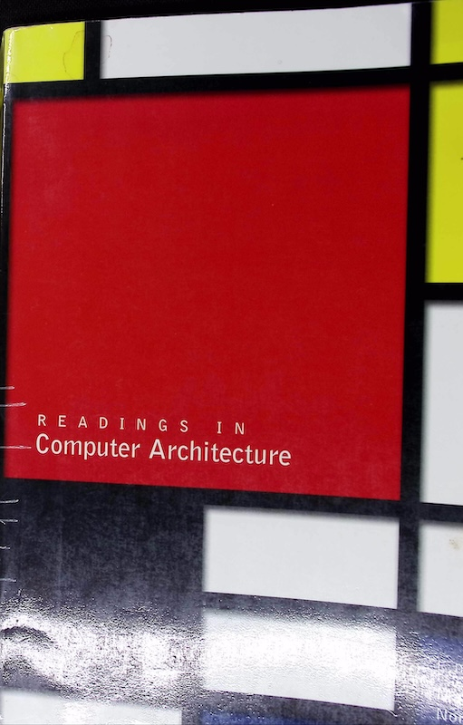

# 《计算机体系结构读物》Readings In Computer Archtecture

&emsp;&emsp; 这是一本在2000年由老牌出版社Morgan Kaufmann出版的计算机体系结构**经典论文**汇编合订。选取并对重要方向进行评述的编者包括三位计算机体系结构领域的专家：
 - Mark D. Hill 威斯康辛大学麦迪逊分校教授，在2020年已经退休，网站在<https://pages.cs.wisc.edu/~markhill/>
 - Norman P. Jouppi Compaq/HP/DEC 西部研究实验室(WRL: Western Research Laboratory)，当前在Google领导TPU加速器设计，网站在<https://techsysinfra.google/aboutus/tsi-leaders/norm-jouppi/>
 - Durindar S. Sohi 威斯康辛大学麦迪逊分校教授，网站在<https://pages.cs.wisc.edu/~sohi/>

&emsp;&emsp; 
**《计算机体系结构读物》实体封面照片**。

书名：《计算机体系结构读物》Readings in computer architecture
简要目录ToC：

0. 前言Preface
1. 经典机器：技术、实现和经济Classic Machines: Technology, Implementation, and Economics
2. 方法Methods
3. 指令集Instruction Sets
4. 指令级并行Instruction Level Parallelism (ILP)
5. 数据流和多线程Dataflow and Multithreading
6. 内存系统Memory Systems
7. 输入/输出：外存储系统、网络和图形I/O: Storage Systems, Networks, and Graphics
8. 单指令多数据并行Single-Instruction Multiple Data (MIMD) Parallelism
9. 多处理器与多机架式Multiprocessors and Multicomputers
10. 当前实现与未来展望Recent Implementations and Future Prospects